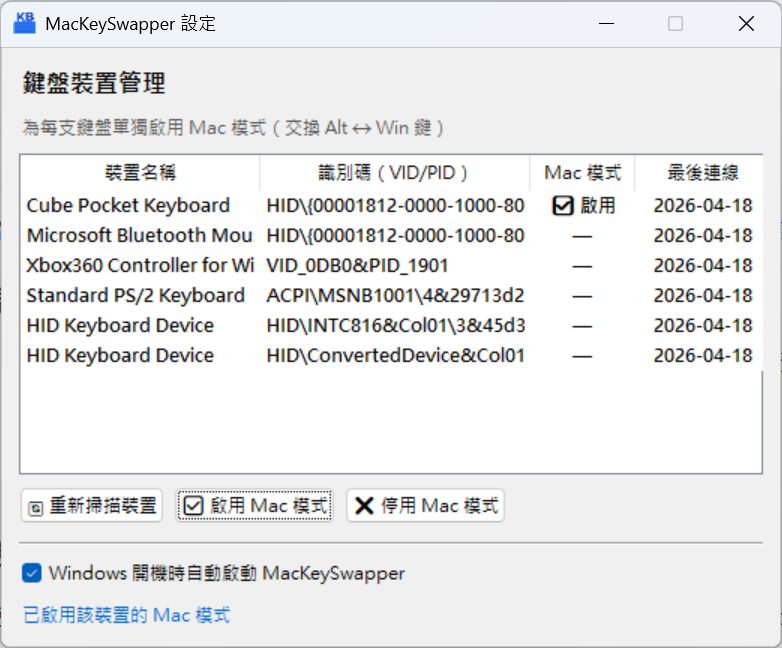
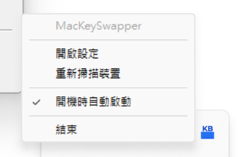

# MacKeySwapper

> 一個在 Windows 下針對單一鍵盤做按鍵對應的常駐小程式，專為 Mac 鍵盤接 PC 使用情境設計。





---

## 目錄

- [背景與問題描述](#背景與問題描述)
- [功能需求](#功能需求)
- [非功能需求](#非功能需求)
- [系統架構](#系統架構)
- [技術選型](#技術選型)
- [專案目錄結構](#專案目錄結構)
- [核心運作流程](#核心運作流程)
- [資料結構](#資料結構)
- [已知限制與技術挑戰](#已知限制與技術挑戰)
- [開發環境](#開發環境)
- [未來擴充方向](#未來擴充方向)

---

## 背景與問題描述

### 鍵盤按鍵差異

PC 鍵盤與 Mac 鍵盤在空白鍵左側的按鍵排列順序是對調的：

| 位置 | PC 鍵盤 | Mac 鍵盤 |
|------|---------|---------|
| 空白鍵左側（內側） | `Alt` | `Command ⌘`（對應 Win 鍵） |
| 空白鍵左側（外側） | `Windows ⊞` | `Option ⌥`（對應 Alt 鍵） |

當使用者將 Mac 藍牙鍵盤連接至 Windows 電腦時，肌肉記憶會導致按鍵錯誤。

### 現有解決方案的不足

- **SharpKeys** 等工具透過修改 Windows Registry 的 `Scancode Map` 進行對應，屬於 **Kernel 層級的全局設定**，不分鍵盤裝置一律套用。
- **Mac 系統**可針對每支已連接的鍵盤個別設定按鍵交換，互不影響。
- Windows 目前沒有原生支援「針對單一裝置做按鍵對應」的機制。

### 使用情境

使用者擁有 **Apple Magic Keyboard、iPad藍牙鍵盤**，偶爾也會連接至 Windows 電腦使用。希望：
- 只針對特定 Mac 鍵盤交換 `Alt` 與 `Win` 鍵
- 不影響其他已連接的 PC 鍵盤
- 設定可記憶，下次連接時自動套用

---

## 功能需求

### FR-01｜鍵盤裝置識別

- 程式啟動時，自動列出目前已連接的所有鍵盤裝置
- 以裝置的 **硬體識別碼（HID DeviceInstanceId，包含 VID/PID）** 作為唯一識別
- 支援 USB 與藍牙（BT）兩種連接方式

### FR-02｜按鍵交換設定

- 使用者可為每支鍵盤單獨指定是否啟用「Mac 模式」
- 啟用 Mac 模式後，該鍵盤的 `Alt` 與 `Win（Windows/Super）` 鍵自動對調
- 對調僅作用於指定裝置，其他鍵盤不受影響

### FR-03｜設定記憶

- 所有鍵盤的設定以 **JSON 格式儲存至本地設定檔**
- 設定包含：裝置識別碼、裝置名稱（供辨識用）、是否啟用 Mac 模式
- 下次連接同一支鍵盤時，自動套用上次的設定，無需重新設定

### FR-04｜System Tray 常駐

- 程式常駐於 **Windows 系統匣（System Tray）**，不佔用工作列
- 右鍵點選 Tray 圖示顯示選單，包含：
  - 開啟設定視窗
  - 查看目前已啟用的裝置
  - 結束程式

### FR-05｜設定視窗

- 可從 Tray 右鍵選單呼叫設定視窗
- 視窗顯示目前已記錄的所有鍵盤，及其 Mac 模式開關狀態
- 可直接在視窗中切換各鍵盤的 Mac 模式開關

### FR-06｜開機自動啟動

- 在設定視窗中提供「開機時自動啟動」的勾選選項
- 啟用後將程式捷徑寫入 Windows 啟動資料夾（或 Registry Run Key）
- 關閉後移除對應的啟動項目

---

## 非功能需求

| 項目 | 說明 |
|------|------|
| 效能 | 鍵盤鉤子的攔截延遲不可明顯影響輸入體驗（目標 < 5ms） |
| 相依性 | 不依賴 AutoHotkey 或其他第三方常駐工具 |
| 可維護性 | 以 Python 撰寫，模組化設計，方便後續維護與擴充 |
| 相容性 | 支援 Windows 10 / 11 |
| 資料儲存 | 設定檔儲存於使用者目錄下，不寫入系統目錄 |

---

## 系統架構

```
┌─────────────────────────────────────────────────────┐
│                    MacKeySwapper                     │
│                                                     │
│  ┌──────────┐   ┌──────────────┐   ┌─────────────┐ │
│  │  Tray UI  │   │  設定視窗    │   │  開機啟動    │ │
│  │ (pystray) │   │  (tkinter)  │   │  管理模組    │ │
│  └─────┬────┘   └──────┬───────┘   └─────────────┘ │
│        │               │                            │
│        └───────┬────────┘                           │
│                │                                    │
│         ┌──────▼──────┐                             │
│         │  Config 管理 │  ←── config.json            │
│         │  (config.py) │                             │
│         └──────┬───────┘                            │
│                │                                    │
│    ┌───────────▼─────────────┐                      │
│    │      Hook 引擎           │                      │
│    │      (hook.py)          │                      │
│    │                         │                      │
│    │  ┌──────────────────┐   │                      │
│    │  │  Raw Input API   │   │  ← 識別來源鍵盤       │
│    │  └──────────────────┘   │                      │
│    │  ┌──────────────────┐   │                      │
│    │  │  LL Keyboard Hook│   │  ← 攔截並交換按鍵     │
│    │  └──────────────────┘   │                      │
│    └─────────────────────────┘                      │
│                │                                    │
│    ┌───────────▼─────────────┐                      │
│    │     Device 管理          │                      │
│    │     (device.py)         │                      │
│    │  列舉 / 識別 HID 裝置    │                      │
│    └─────────────────────────┘                      │
└─────────────────────────────────────────────────────┘
```

---

## 技術選型

| 元件 | 技術 | 說明 |
|------|------|------|
| 主要語言 | Python 3.10+ | 易於維護，生態豐富 |
| System Tray | `pystray` | 跨平台 Tray 圖示支援 |
| 設定視窗 | `tkinter` | Python 內建，無需額外安裝 |
| 鍵盤鉤子 | `pywin32`（`ctypes`） | 呼叫 Win32 API `SetWindowsHookEx` |
| 裝置識別 | `pywin32` + Raw Input API | 透過 `WM_INPUT` 識別鍵盤來源 |
| 裝置列舉 | `pywin32` / `wmi` | 取得 HID DeviceInstanceId（VID/PID） |
| 設定儲存 | `json`（標準函式庫） | 儲存為本地 JSON 設定檔 |
| 開機啟動 | `winreg`（標準函式庫） | 寫入 Registry `HKCU\Software\Microsoft\Windows\CurrentVersion\Run` |

---

## 專案目錄結構

```
D:\SynologyDrive\Project\MacKeySwapper\
│
├── README.md               # 本文件：需求與架構說明
│
├── main.py                 # 程式進入點，初始化各模組並啟動事件迴圈
├── tray.py                 # System Tray 圖示與右鍵選單
├── hook.py                 # Low-Level Keyboard Hook + Raw Input 整合
├── device.py               # 鍵盤裝置列舉與 HID 識別
├── config.py               # 設定檔讀寫（JSON）
├── settings_ui.py          # 設定視窗（tkinter）
├── startup.py              # 開機自動啟動管理（Registry）
│
├── assets/
│   ├── icon.ico            # Tray 圖示（正常狀態）
│   └── icon_active.ico     # Tray 圖示（有裝置啟用中）
│
├── config.json             # 使用者設定檔（自動產生，勿手動編輯）
│
├── requirements.txt        # Python 套件相依清單
└── build.bat               # （選用）打包成 .exe 的腳本（使用 PyInstaller）
```

---

## 核心運作流程

### 啟動流程

```
main.py 啟動
    │
    ├─► config.py  載入 config.json（或建立預設值）
    ├─► device.py  列舉目前已連接的鍵盤裝置
    ├─► hook.py    安裝 LL Keyboard Hook + 註冊 Raw Input
    ├─► tray.py    建立 System Tray 圖示
    └─► 進入 Windows 訊息迴圈（阻塞）
```

### 按鍵攔截流程

```
使用者按下按鍵
    │
    ├─► Raw Input (WM_INPUT) 收到事件
    │       └─► 記錄「最後一次輸入來自哪支鍵盤」的 Handle
    │
    └─► LL Keyboard Hook (WH_KEYBOARD_LL) 收到事件
            │
            ├─► 查詢 Raw Input 記錄的裝置 Handle
            ├─► 對應至 DeviceInstanceId（查 device.py）
            ├─► 查詢 config.json 該裝置是否啟用 Mac 模式
            │
            ├─► [啟用中] 若按鍵為 Alt → 轉發為 Win 鍵
            ├─► [啟用中] 若按鍵為 Win → 轉發為 Alt 鍵
            └─► [未啟用] 直接放行，不做處理
```

### 設定變更流程

```
使用者在設定視窗切換 Mac 模式開關
    │
    ├─► settings_ui.py 呼叫 config.py 更新設定
    ├─► config.py 寫入 config.json
    └─► hook.py 即時套用新設定（不需重啟程式）
```

---

## 資料結構

### `config.json` 格式

```json
{
  "startup": true,
  "keyboards": [
    {
      "device_id": "HID\\VID_05AC&PID_0256\\...",
      "friendly_name": "Apple Magic Keyboard",
      "mac_mode": true,
      "last_seen": "2025-04-17T10:30:00"
    },
    {
      "device_id": "HID\\VID_046D&PID_C52B\\...",
      "friendly_name": "Logitech USB Keyboard",
      "mac_mode": false,
      "last_seen": "2025-04-10T08:00:00"
    }
  ]
}
```

### 欄位說明

| 欄位 | 型別 | 說明 |
|------|------|------|
| `startup` | bool | 是否開機自動啟動 |
| `device_id` | string | HID DeviceInstanceId，作為唯一識別碼 |
| `friendly_name` | string | 裝置顯示名稱（供使用者辨識） |
| `mac_mode` | bool | 是否啟用 Alt ↔ Win 交換 |
| `last_seen` | string | 最後一次偵測到該裝置的時間（ISO 8601） |

---

## 已知限制與技術挑戰

### 1. Raw Input 與 LL Hook 的時序問題

`WM_INPUT` 和 `WH_KEYBOARD_LL` 是兩個獨立的訊息來源，**無法保證兩者完全同步**。目前設計採用「記錄最近一次 Raw Input 的來源裝置」來推斷當前按鍵的來源，在一般使用情境下準確率高，但若兩支鍵盤**極快速交替輸入**，理論上可能出現判斷錯誤。

### 2. 藍牙裝置的 DeviceInstanceId 穩定性

部分藍牙鍵盤在重新配對後，其 DeviceInstanceId 的後半段（Instance path）可能改變，導致無法匹配到既有設定。目前以 **VID+PID** 作為主要匹配依據，配合裝置名稱輔助，可降低此問題的發生機率。

### 3. 需要以管理員權限執行

安裝 Low-Level Keyboard Hook 在某些安全政策嚴格的環境下可能需要管理員權限。

---

## 開發環境

```
作業系統：Windows 10 / 11
Python：3.10 以上
```

### 安裝相依套件

```bash
pip install pystray pywin32 Pillow
```

### 執行

```bash
python main.py
```

### 打包為獨立執行檔（選用）

```bash
pip install pyinstaller
pyinstaller --noconsole --onefile --icon=assets/icon.ico main.py
```

---

## 未來擴充方向

- [ ] 支援更多按鍵對應組合（不限於 Alt/Win 交換）
- [ ] 提供 GUI 設定任意按鍵的重對應
- [ ] 自動偵測新裝置連接並跳出提示詢問是否設定
- [ ] 支援多組設定 Profile，依場景切換
- [ ] 提供匯出 / 匯入設定檔功能

---

*文件版本：v1.0 | 建立日期：2025-04-17 | 作者：初始設計*
